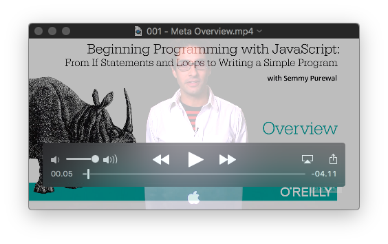
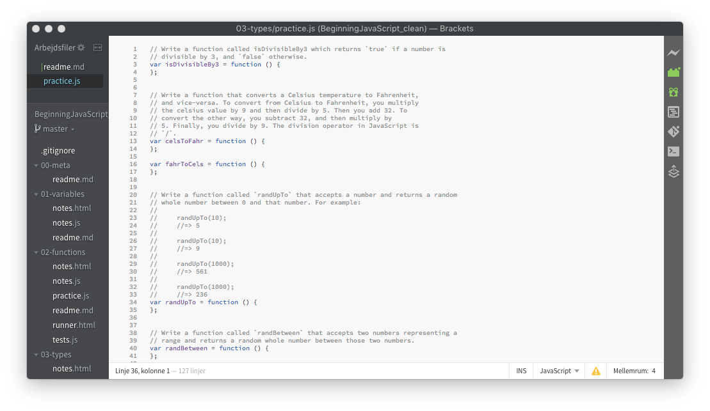
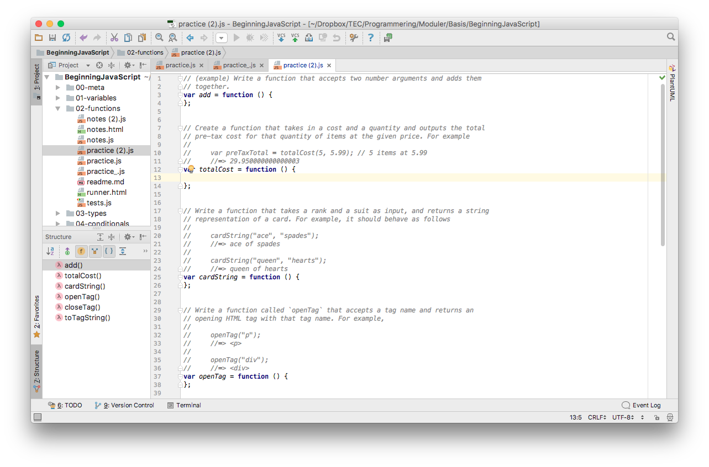

# Beginning JavaScript

Dette undervisningsmateriale tager udgangspunkt I Semmy Purewals Online kursus "Beginning JavaScript" som er udgivet på SafariBooks Online. 

> __Det er meningen af du skal lave en `fork` af dette projekt, som er din egen.__

> __Denne `fork`, din egen kopi af github-projektet, skal du `clone`, og så lave `commit`, og `push` til GitHub, så dine opgave besvarelser ligger der.__

Kursuet består af nogle videoer hvor Semmy gennemgår dele af javascript sproget og de man skal vide for at løse de opgaver der hører til hvert kapitel. Opgaverne i kapitlerne er både nogle øvelser du bare skal udføre i en browser (debug viduets console) og nogle opgaver det skal løses ved at skrive kode i en editor, f.eks Brackets eller WebStorm. 
 
Til opgaverne hører der et testscript, som du kører i browseren til at afprøve dit program. Efter hånden som din program besvarer opgaven bedre og bedre, bliver testen også mere og mere "rigtig" .

Selve vidoerne må du spørge din lærer om at give dig adgang til at se.

## Indhold

### meta
[Kursusbeskrivelse](./00-meta/readme.md)
 - 1 Meta - Overview 00:04:16
 - 2 Meta - Using these Videos 00:03:11
 
### basics
 - 3 Basics - Working with the Browser and a Text Editor 00:03:42

### variables
[Chapter 01](./01-variables/readme.md)

+ overview
    - _4 Variables - Overview 00:05:51_
+ declaring variables   
+ defining variables
+ manipulating values via variables
    - _5 Variables - Working with String Expressions 00:04:04_
+ non-string variables
    - _6 Variables - Working with Number Expressions 00:07:03_
+ re-assigning variables
#### practice
    - _7 Variables - Summary & Practice Overview 00:01:49_
    
> [Ingen test](./01-variables/), men øvelser 1-9 nederst i `readme.md`.
   

### functions
[Chapter 02](./02-functions/readme.md)
   
+ overview
+ defining a function
+ calling a function
    - _8 Functions - Defining a Function & Calling a Function 00:15:26_
+ variable scope in functions
+ example with numbers
+ example with strings
    - _9 Functions - Scope & Examples 00:13:25_
    
#### practice
- _10 Functions - Summary & Practice Overview 00:04:07_

>   - [ ] `add`
>   - [ ] `totalCost`
>   - [ ] `cardString`
>   - [ ] `openTag`
>   - [ ] `closeTag`
>   - [ ] `toTagString`

+ tests  
[Kør test](02-functions/runner.html)
   
### Se løsningerne
Ok. Der er løsninger med i pakken. 

Du kan se dem på den branch der hedder `solutions`. 
Lad nu vær' med bare at læse og skrive af. Prøv selv at løse opgaven. Hvis det ikke virker, så spørg en anden elev, spørg en lærer. Og, prøv så en gang til. 
Hvis det stadig ikke virker, så kan du kigge på løsnigerne i `solutions`-branch'en. Prøv bare at kigge på løsningen, og prøv at forstå hvordan det virker, og skriv det så selv bagefter. Husk at det er ØVELSE der gør dig dygtig til programmering og IT. 
I sidste ende er jeg, din lærer, der jo, til at hjælpe.
- _11 Accessing Solutions to the Practice Problems 00:01:33_

### types
[Chapter 03](./03-types/readme.md)
+ overview
 - _12 Types - Overview 00:01:37_
+ the typeof function
 - _13 Types - The typeof Operator 00:08:40_
+ number types and arithmetic expressions
 - _14 Types - Numbers and Arithmetic Expressions 00:10:30_
+ extending the number operations with Math
+ string types and built-in methods
 - _15 Types - Strings 00:10:35_
+ boolean types and boolean expressions 
 - _16 Types - Boolean Types and Boolean Expressions 00:08:08_
 - _17 Types - Complex Boolean Expressions 00:09:09_
+ creating functions to test types 
 - _18 Types - Functions that Test Types 00:09:25_

#### practice
 - 19 Types - Summary & Practice Overview 00:05:24
 
 Øvelse 1 og 2 nederst i `readme.md`, 
 og 6 opgaver i `practice.js`.

 > - [ ] `isDivisibleBy3`
 > - [ ] `celsToFahr`
 > - [ ] `fahrToCels`
 > - [ ] `randUpTo`
 > - [ ] `randBetween`
 > - [ ] `isSuit`
 > - [ ] `isRank`
 > - [ ] `isCard`
 > - [ ] `isCapitalized`
 > - [ ] `getHTMLText`
 > - [ ] `isHTMLElement`
 
+ tests
  [Kør test](03-types/runner.html)
  
  
### conditionals (if-statements)  
[Chapter 04](./04-conditionals/readme.md)
+ overview
+ if-statements
+ else clauses in if-statements
 - _20 Conditionals - if-statements & else-clauses 00:14:19_
 - _21 Conditionals - Conditionals in Functions 00:09:35_
+ `if`-`else if` and nested `if` statements
 - _22 Conditionals - if-else-if & nested if-statements 00:14:59_
+ writing robust functions (throwing errors on types)
 - _23 Conditionals - Writing Robust Functions 00:04:15_

#### practice
+ _24 Conditionals - Summary & Practice Overview 00:02:08_

    > - [ ] `passwordStrength`
    > - [ ] `isLeapYear`
    > - [ ] `firstInDictionary`
    > - [ ] `getTagName`
    > - [ ] `improveTweet`
    > - [ ] `isQuestion`
    > - [ ] `magic8Ball`
    > - [ ] `interjectAt`
    > - [ ] `randomInterject`
 
+ tests  
  [Kør test](04-conditionals/runner.html)

 ### loops
[Chapter 05](./05-loops/readme.md)
+ overview
+ while-loops as generalizations of if-statements
+ for-loops
 - _25 Loops - while-loops and for-loops 00:12:12_
+ calculating properties using a loop
 - _26 Loops - Using Loops in Functions 00:07:09_
+ transforming strings with for-loops
 - _27 Loops - Transforming Strings with Loops 00:07:56_
+ breaking out of a loop
 - _28 Loops - Breaking Out of a Loop 00:08:32_
+ iterating backwards
 - _29 Loops - Iterating Backwards! 00:03:37_

#### practice
+ _30 Loops - Summary & Practice Overview 00:02:13_

> - [ ] `isVowel`
> - [ ] `isLowerCaseLetter`
> - [ ] `sumUpTo`
> - [ ] `sumAToB`
> - [ ] `countVowels`
> - [ ] `reverseString`
> - [ ] `isPrime`
> - [ ] `sumPrimesUpTo`
> - [ ] `sumOfFirstNPrimes`
> - [ ] `removeNonLetters`
> - [ ] `isPalindrome`

+ tests
  [Kør test](05-loops/runner.html)
 
### arrays 
[Chapter 06](./06-arrays/readme.md)
+ overview
+ defining an array
+ accessing elements of an array
+ mutating an array
+ using variables for indices
    - _31 Arrays - Overview & Basic Operations 00:12:12_
+ strings as special arrays
    - _32 Arrays - Similarities to Strings 00:05:16_
+ examples
    - _33 Arrays - More Examples 00:14:51_
    - _34 Arrays - Array Types 00:06:14_
+ practice
 - _35 Arrays - Summary & Practice Overview 00:03:08_

 > - [ ] `containsTwice`             
 > - [ ] `containsNTimes`
 > - [ ] `atLeastOneEven`
 > - [ ] `allStrings`
 > - [ ] `containsAnyTwice`
 > - [ ] `getValuesAppearingTwice`
 > - [ ] `range`
 > - [ ] `mapToTags`
 > - [ ] `filterToLol`
 
+ tests
  [Kør test](06-arrays/runner.html)

### array methods
[Chapter 07](./07-arrays-iterators/readme.md)
+ overview
+ forEach
 - _36 Array Iterators - forEach 00:07:45_
+ map
 - _37 Array Iterators - Map 00:10:13_
+ chaining methods that return arrays
 - _38 Array Iterators - Chaining 00:05:41_
+ filter
 - _39 Array Iterators - Filter 00:06:07_
+ some and every
 - _40 Array Iterators - Some and Every 00:05:10_
+ reduce
 - _41 Array Iterators - Reduce 00:13:20_
+ converting between strings and arrays
 - _42 Array Iterators - Converting Between Strings and Arrays 00:05:11_
 
#### practice
- _43 Array Iterators - Summary & Practice Overview 00:05:22_

 > - [ ] `reverse`
 > - [ ] `flatten`
 > - [ ] `sumOfMultiplesOf3And5`
 > - [ ] `atLeastOneVowel`
 > - [ ] `longestAwesomeTweet`
 > - [ ] `elementsToContent`
 > - [ ] `randomArray`
 > - [ ] `randomElements`
 
 Nederst i `07-array-iterators/readme.md` er der ti opgaver hvor du skal bruge array-funktionerne på rigtige, virkelige, statistiske data:
 
    >> - [ ] 1. How many baby names start with the letter 'z'?
    >> - [ ] 2. How many baby names have the letter 'z' in them anywhere?
    >> - [ ] 3. Create a new array that contains all of the names containing a 'w' with the first letter upper-case.
    >> - [ ] 4. Do all of the names contain vowels?
    >> - [ ] 5. Are there any names that have only two letters?
    >> - [ ] 6. Is your name in the list?
    >> - [ ] 7. Find the name that would come first alphabetically.
    >> - [ ] 8. How many times does the letter 'z' appear in the list?
    >> - [ ] 9. What is the maximum number of vowels in any name?
    >> - [ ] 10. How many names have the maximum number of vowels that you found in the previous problem?

+ tests
  [Kør test](07-arrays-iterators/runner.html)
 
### objects 
[Chapter 08](./08-objects/readme.md)
+ overview
+ defining an object
+ accessing elements of an object
+ mutating an object
+ using variables for keys
    - _44 Objects - Overview & Basic Operations 00:11:36_
+ using array functions on objects
+ arrays of objects
    - _45 Objects - The Relationship Between Objects and Arrays 00:04:28_
+ nested objects
    - _46 Objects - Complex Objects 00:03:41_
    - _47 Objects - Checking Object Types 00:05:13_
    
#### practice
- _48 Objects - Summary & Practice Overview 00:05:20_
 
I `practice.js` finder du fire opgaver:   

 > - [ ] `isUser`
 > - [ ] `userToDiv`
 > - [ ] `userWithTweetsToDiv`
 > - [ ] `frequencies`
 
Desuden er der to set øvelser mere (se også `08-objects/readme.md`):

> For this set of questions, open up the file called `cards.html` in Chrome, then open the developer console. There should be a variable defined called `cards`. You can confirm this by typing it at the console.
> 
>     cards;
>     //=> Array[5000]
> 
> This contains 5000 card objects, randomly generated by a function that you'll write a little later. Interact with the console and answer the following questions.
> 
>  - [ ] 1. Which suit appears the most frequently?
>  - [ ] 2. Which rank appears the most frequently?
>  - [ ] 3. How many times does the ace of spades appear? What about the two of clubs?
>  - [ ] 4. Can you think of a way to determine which card appears the most frequently?
> 
> Obviously, you can repeat the process above for all 52 combinations, but is there an automated way you can do it? By the end of all of the subsequent exercises, you should be able to do this using a single function.
> 
> For the next set of questions, open up the file `tweets.html` in Chrome, then open the developer console. There should be a variable defined called `tweets`. You can confirm this by typing it at the console.
> 
>     tweets;
>     //=> Array[500]
> 
> This is an array that contains a random sample of 500 tweets from the afternoon of Sunday, October 26, 2014. Using our favorite array methods (`map`, `filter`, `reduce`, `some`, and `every` methods) answer the following questions.
> 
>  - [ ] 5. Create an array that only contains only the tweet texts that contain the word "awesome" (upper or lower case). How many tweets are in the array?
>  - [ ] 6. How many of the tweets contains URLs in them? (You can just look for "http:" as a substring).
>  - [ ] 7. How many of the tweets are associated with users who have underscores ("_") in their screen name?
>  - [ ] 8. What is the screen name of the user with the most followers?
>  - [ ] 9. The "statuses_count" property of a user object contains the number of tweets that the user has tweeted. How many users have tweeted exactly 1 tweet? What are their screen names?
>  - [ ] 10. What is the average number of followers among those users associated with tweets that contain "lol" (case insensitive)?

+ tests
 [Kør test](08-objects/runner.html)
 
 
### poker simulation
[Chapter 09](09-poker-simulation/readme.md)

Start med at lave funktionerne i `09-poker-simulation/practice.js`, så følg instruktionerne nederst i `09-poker-simulation/readme.md`. Nemli' at åbne `09-poker-simulation/simulation.html` og køre simulationen derfra.

 - _49 Putting It All Together 00:08:49_
 
#### Practice

 > - [ ] `isSuit`
 > - [ ] `isRank`
 > - [ ] `isCard`
 > - [ ] `isDeck`
 > - [ ] `createDeck`
 > - [ ] `shuffle`
 > - [ ] `isHand`
 > - [ ] `dealHand`
 > - [ ] `isHigherThan`
 > - [ ] `isLowerThan`
 > - [ ] `highCard`
 > - [ ] `lowCard`
 > - [ ] `containsPair`
 > - [ ] `containsTwoPair`
 > - [ ] `containsThreeOfAKind`
 > - [ ] `containsStraight`
 > - [ ] `containsFlush`
 > - [ ] `containsFullHouse`
 > - [ ] `containsFourOfAKind`
 > - [ ] `containsStraightFlush`
 > - [ ] `containsRoyalFlush`
 > - [ ] `highestRank`

 + tests
   [Kør test](09-poker-simulation/runner.html)
 